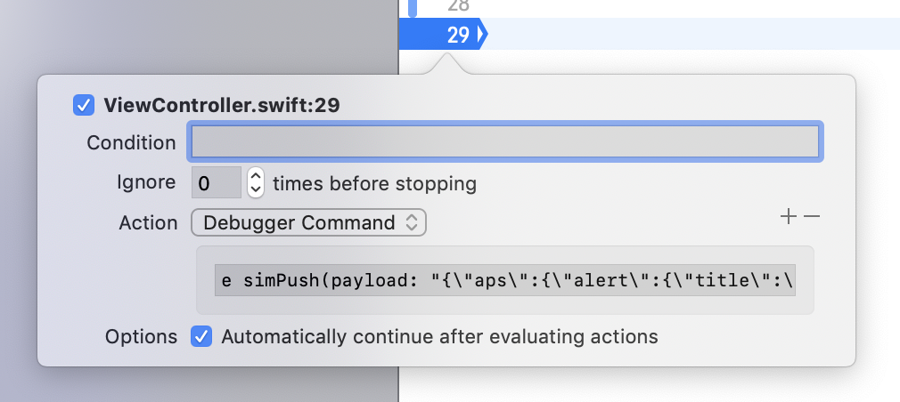
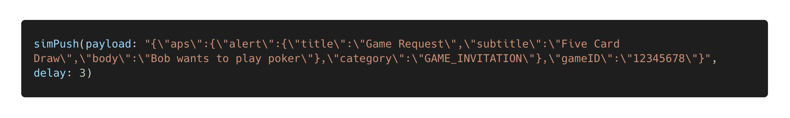

# PushNotificationSimulation

`PushNotificationSimulation` helps in simulating push notifications in the application during development.

[](https://swift.org/)
[](https://travis-ci.org/pwlkania/PushNotificationSimulation.svg?branch=master)
[](https://cocoapods.org/pods/PushNotificationSimulation)
[](https://github.com/Carthage/Carthage)
[](http://cocoadocs.org/docsets/PushNotificationSimulation)
[](https://github.com/PGSSoft/PushNotificationSimulation)

## Installation

Using [Cocoapods](https://cocoapods.org/) with Podfile:

```ruby
pod 'PushNotificationSimulation'
```

or using [Carthage](https://github.com/Carthage/Carthage) and add a line to `Cartfile`:

```
github "pwlkania/PushNotificationSimulation"
```

or Swift Package Manager (Xcode 11):

Coming soon!

## Requirements

iOS 11.0

## Initialization

Modify your `AppDelegate.swift` file:

Import `PushNotificationSimulation` framework (if needed):

```swift
import PushNotificationSimulation
```

Implement `PushNotificationSimulation` protocol:

```swift
#if DEBUG
extension AppDelegate: PushNotificationSimulation { }
#endif
```

## Usage

Using breakpoints with debugger command (suggested approach) - example:

```
e simPush(payload: "{\"aps\":{\"alert\":{\"title\":\"Game Request\",\"subtitle\":\"Five Card Draw\",\"body\":\"Bob wants to play poker\"},\"category\":\"GAME_INVITATION\"},\"gameID\":\"12345678\"}", delay: 3)
```



You can also use `simPush(...)` global function directly in the code. However it might cause issues when code is not deactivated in production version of your application. Be careful.



## License

The project is available as open source under the terms of the [MIT License](http://opensource.org/licenses/MIT).
